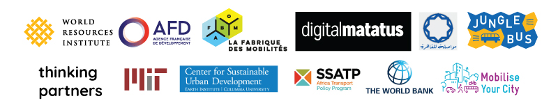

# Digital Transport 4 Africa - Basic Knowledges

L’Afrique est dans une phase historique de construction rapide de la ville. Le pays développe et construit aujourd’hui les infrastructures et les systèmes de transports qui permettront de desservir l’ensemble du continent dans le futur. Permettre le développement d’offres de transports sécurisées, abordables, accessibles et durables pour tout un chacun est donc fondamental pour créer des territoires viables, productifs, peu polluants et offrir des bonnes conditions de vie et des services aux populations africaines.

La plupart des villes africaines disposent d’offres de transports informelles, souvent réalisés par des minibus et opérées par des sociétés privées. Ces dispositifs offrent un service dynamique pour tous, sans coût pour la collectivité, mais ne sont pas optimaux notamment en ce qui concerne les embouteillages, la pollution et la sécurité routière. Nous pensons que le challenge est d'aider ces opérateurs et proposer des technologies et un travail qui leur permettra de faire évoluer leurs offres.

Les technologies numériques sont une excellente opportunité de travailler avec l’ensemble des opérateurs et de développer des partenariats gagnant-gagnant, notamment par la création de données de transports qui manquent aujourd’hui pour créer un véritable système d’informations voyageurs.

A Paris, en Novembre 2017, l’AFD a mobilisé un groupe d’experts, d’universitaires, de consultants, fonctionnaires qui utilisent les technologies digitales pour générer des données et améliorer la mobilité dans les villes africaines. L’objectif à terme est de créer une plateforme ouverte et collaborative dans le but de

* capitaliser sur le travail déjà réalisé,
* proposer des normes,
* mutualiser les coûts dans le travail sur les données,
* permettre une indépendance dans la gestion des données.

En faisant la promotion de l’ouverture des données de transports, des outils en open source et de la création de communs, est née l’idée de créer un centre de ressource ouvert.

